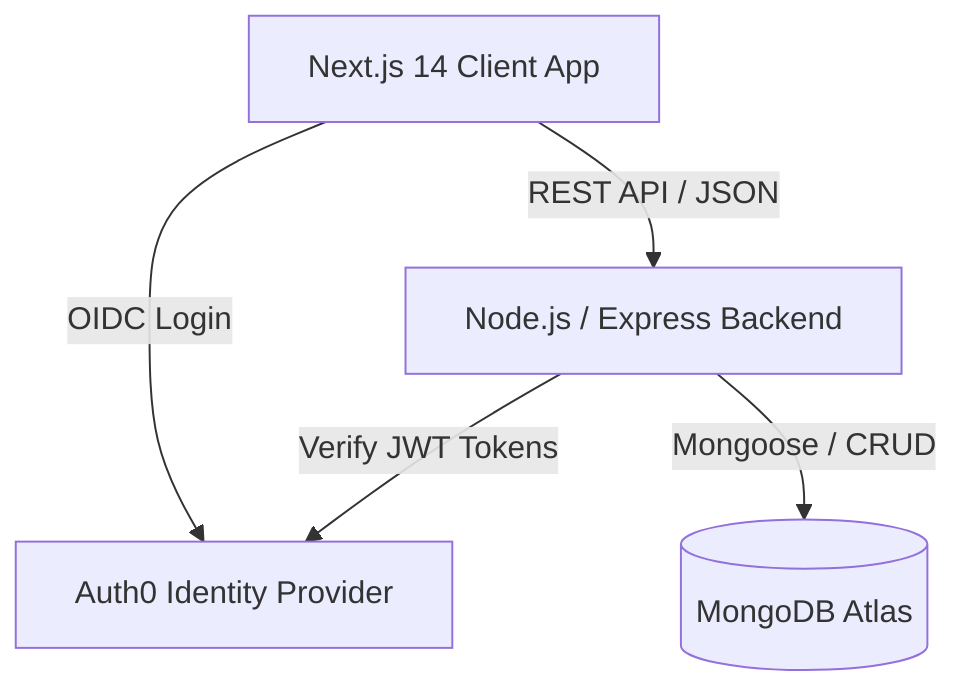

# Job-Findrr – Full-Stack Job Portal

A production-ready job search and posting platform engineered with **Next.js 14**, **Node.js/Express**, and **MongoDB**. Designed with a modular, decoupled architecture to ensure high performance, secure authentication via **Auth0**, and independent scalability.

---

## Live Demo

- **Frontend:** [job-findrr.vercel.app](https://job-finder-deployed.vercel.app/)
- **Backend API:** [jobfindrr-backend.onrender.com](https://jobfindrr-backend.onrender.com)

---

## System Architecture

The application utilizes a **Decoupled Client-Server Architecture** to separate presentation logic from core business logic, enabling independent scaling and deployment.



### Core Engineering Decisions & Tradeoffs

During development, I made several architectural decisions based on scalability, developer velocity, and performance:

1. **Decoupled Architecture (Next.js + Express) vs. Next.js Monolith**
   * *The Decision:* Even though Next.js supports full-stack API routes, I explicitly chose to build a standalone Node.js/Express backend.
   * *The Tradeoff:* It increases deployment complexity (managing two CI/CD pipelines on Vercel and Render). However, it makes the API completely decoupled and reusable. If we ever want to build a React Native mobile app in the future, the backend is ready to serve it without being tied to the web presentation layer.

2. **NoSQL (MongoDB) vs. Relational SQL**
   * *The Decision:* Selected MongoDB for data persistence.
   * *The Tradeoff:* We sacrifice strict relational integrity (like foreign key constraints) for high schema flexibility. Job postings often require dynamic fields, variable lists of skill tags, and custom metadata. A NoSQL document store allows rapid iteration on the data model without constant database migrations.

3. **Managed Authentication (Auth0) vs. Custom JWT Implementation**
   * *The Decision:* Offloaded authentication and session management to Auth0 using secure, cross-origin cookies.
   * *The Tradeoff:* Adds a third-party dependency, but drastically reduces the security surface area. We don't store passwords, preventing data breaches, and we get enterprise-grade security (OIDC, secure cookie handling) out of the box, letting me focus on core business logic.

---

## Tech Stack

| Domain | Technologies |
| :--- | :--- |
| **Frontend** | Next.js 14 (App Router), TypeScript, Tailwind CSS, Radix UI |
| **Backend** | Node.js, Express.js, Mongoose, REST APIs |
| **Database** | MongoDB Atlas (Cloud-hosted NoSQL) |
| **Authentication** | Auth0 (`express-openid-connect`), Secure Cross-Origin Cookies |
| **DevOps / Infra** | Vercel (Frontend), Render (Backend), GitHub Actions CI/CD |

---

## Core Features

- **Advanced Job Search & Filtering:** Filter by title, required skills, and location.
- **Dynamic Job Posting Form:** Custom form supporting dynamic skill tags and rich descriptions.
- **Enterprise-Grade Authentication:** Auth0 login with automatic profile synchronization to MongoDB.
- **"My Jobs" Dashboard:** Dedicated panels for both job seekers (applications) and recruiters (postings).
- **Cross-Origin API Protection:** Configured strict CORS policies and secure HTTP-only cookies.

---

## Performance & Scalability Highlights

- **Cold Start Time:** `< 2s` (Optimized Next.js builds on Vercel)
- **API Response Time:** `~250–300ms p95 latency` for core database queries.
- **Concurrency:** Architecture supports 1,000+ concurrent connections.
- **Zero Downtime Deployments:** Automated pipelines ensure test deploys have no user impact.

---

## Folder Structure

```text
panchadip-128-job_findrr/
├── client/                 # Next.js 14 frontend environment
│   ├── app/                # Next.js App Router & Pages
│   ├── Components/         # Reusable React components (Radix UI + Tailwind)
│   ├── context/            # Global React Context providers
│   └── utils/              # Helper functions and API clients
└── server/                 # Express.js backend environment
    ├── controllers/        # Route logic and business operations
    ├── db/                 # MongoDB connection instances
    ├── middleware/         # Auth, Error handling, and validation
    ├── models/             # Mongoose schemas
    └── routes/             # REST API endpoint definitions
```

---

## Local Setup & Installation

**1. Clone the repository**
```bash
git clone https://github.com/Panchadip-128/Job_Findrr.git
cd Job_Findrr 
```

**2. Setup Frontend**
```bash
cd client
npm install
```

**3. Setup Backend**
```bash
cd ../server
npm install
```

**4. Environment Variables**
Create a `.env` file in the `/server/` directory:
```env
PORT=5000
MONGO_URI=your_mongodb_atlas_uri
CLIENT_ID=your_auth0_client_id
ISSUER_BASE_URL=https://your_auth0_domain
SECRET=your_auth0_secret
CLIENT_URL=http://localhost:3000
BASE_URL=http://localhost:5000
```

**5. Run the Application**
```bash
# Terminal 1 (Frontend)
cd client
npm run dev

# Terminal 2 (Backend)
cd server
npm run dev
```

---

## License
This project is open source and available under the [MIT License](LICENSE).
